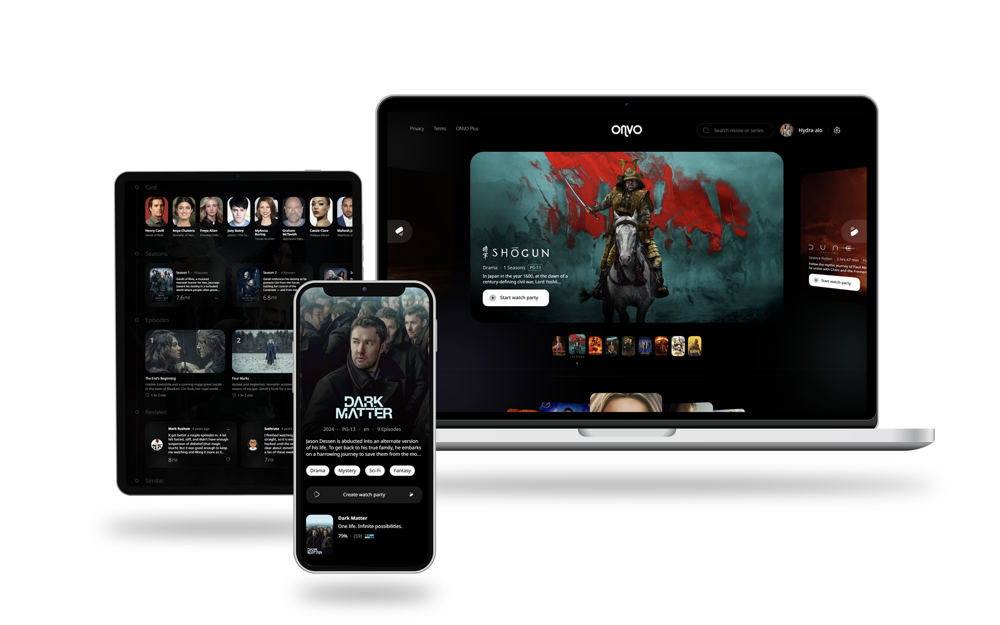

# ONVO TV

Welcome to ONVO TV, the ultimate platform for synchronized watch parties! With ONVO TV, you can enjoy movies, TV shows, and anime with friends and family, no matter where they are. Our app ensures perfect synchronization of playback, making virtual movie nights just as enjoyable as being together in person.

## Features

### Synchronized Watch Parties
- **Watch Together**: Enjoy movies, TV shows, or anime with friends and family in perfect sync.
- **Real-Time Playback**: Experience seamless, synchronized playback to ensure everyone enjoys the content simultaneously.

### Magic Portal
- **Play on Any Device**: Open ONVO TV on any device locally without the need for internet.
- **Universal Access**: Use the Magic Portal to run ONVO TV on smart TVs and other devices without installing the app.
- **No Installation Required**: Simply use the provided link to start watching instantly on compatible devices. The Magic Portal makes connected devices explore the host TV from the browser and works for every device on the local network.

### Direct Streaming Links
- **Quick Access**: Access your favorite content directly through provided movie links.
- **Instant Playback**: Start watching immediately without waiting for downloads.
- **Popular Integrations**: Enjoy seamless integration with popular movie providers like Netflix, Disney+, Amazon Prime, and more.

### Subtitles for Every Viewer
- **Custom Subtitles**: Set your own subtitles in your preferred language.
- **Inclusive Viewing**: Watch together with friends who speak different languages, making the experience enjoyable for everyone.

## Getting Started

### Prerequisites
- A device with internet access.
- A compatible browser for accessing the ONVO TV platform.

### Installation
Available for every platform! Download the ONVO TV app for your device:

- [Windows](https://ovtv.me/download#windows)
- [Android](https://ovtv.me/download#android)
- [iOS](https://ovtv.me/download#ios)
- [macOS](https://ovtv.me/download#mac)
- [Linux](https://ovtv.me/download#linux)

## Usage

1. **Create an Account**: Sign up or log in to your ONVO TV account.
2. **Start a Watch Party**: Choose a movie, TV show, or anime and start a synchronized watch party.
3. **Invite Friends**: Share the watch party link with friends and family.
4. **Use the Magic Portal**: For local device playback, use the Magic Portal link to watch on smart TVs and other devices without the app.

## Contributing

We welcome contributions from the community! To contribute, follow these steps:
1. Fork the repository.
2. Create a new branch (`git checkout -b feature-branch`).
3. Commit your changes (`git commit -am 'Add new feature'`).
4. Push to the branch (`git push origin feature-branch`).
5. Create a new Pull Request.

## License

This project is licensed under the Creative Commons Attribution-NonCommercial-NoDerivatives 4.0 International License. See the [LICENSE](./LICENSE) file for details.

## Contact

For support or inquiries, please contact us at [support@onvo.me](mailto:support@onvo.me).

---

Join the ONVO TV community and elevate your watch party experience to the next level!
